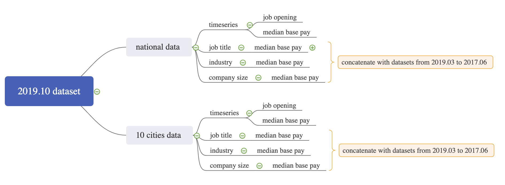

# Data transformation


## Glassdoor

1.	The raw dataset is monthly. In order to explore the temporal changes of median base pay, we first concatenated the 22 datasets into a single data frame. 

2.	Since national data and city level data are on different levels, we separated the dataset into two main categories: national level and city levels.

3.	The next step is to construct the datasets containing only the variables we are interested in, which are for futher analysis. Here are a few examples:

      a.	In order to focus on the relationship between job title and median base pay, we subsetted the corresponding dataset:
```{r, echo=FALSE}
city_jobtitle = read_csv("../data/clean/glassdoor/city_jobtitle.csv")
head(city_jobtitle)
```

      b.	In order to find out the secular and cyclical trend of median base pay, we subsetted the corresponding dataset:
      
```{r, echo=FALSE}
na_ts_pay = read_csv("../data/clean/glassdoor/na_ts_pay.csv")
head(na_ts_pay)
```

We did the subsetting for all possible dimensions and got 10 separate datasets in total: na_industry, na_jobtitle, na_size, na_ts_opening, na_ts_pay, city_industry, city_jobtitle, city_size and city_ts. As for the filenames, na stands for national; ts stands for timeseries; size stands for company size; opening stands for job opening; pay stands for median base pay.

Here is a graph indicates the structure of the cleaning process




## Indeed

We used Indeed dataset in two parts of the analysis and conducted the data cleaning process differently based on different needs:

1.    To find out the regional distribution pattern of the four data related jobs we are interested in: data analyst, data scientist, business analyst and financial analyst, we scraped all the search results from indeed using the four job titles, then grouped the jobs by state and finally counted their numbers.

```{r, echo=FALSE}
df_total_state = read_csv("../data/clean/indeed/df_total_state.csv")
head(df_total_state)
```

2.    We need to plot wordclouds to help us analyze. In python, we vectorized the details by 1-gram and 2-gram, removing common English stopwords and some less informative words. Then we combined 1-gram and 2-gram into one list. The final result is in the form of word vs. frequency.


## City data

The goal of the data cleaning is to map city statistics to 10 cities. 

The median income column should be numeric, but they are characters with dollar signs and commas. Thus we removed the dollar signs and commas, and then convert them to numeric forms.

Firstly we used two for loops to map the city statistics into cities. However, the city names in each dataset are different, which led to some mismatches. To fix it, we assigned the values manually.

There is no value of all_median_income in Atlanta in 2018. In order to draw the parallel coordinates plot, we found this value from somewhere else.

To find the patterns in different cities, I standardized the data before drawing the parallel coordinates plot.


